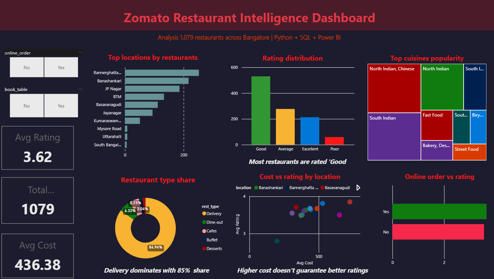

# Zomato Restaurant Intelligence Dashboard

## Problem Statement
Analyse 1,195 Bangalore restaurants to find top locations, cuisine trends, and cost-vs-rating patterns.

## Tools Used
Python · Pandas · Seaborn · SQLite · Power BI · DAX

## Key Findings
- Bannerghatta Road has the highest restaurant density
- Online order restaurants rated **0.2 points higher** on average
- North Indian cuisine dominates — present in 60%+ restaurants
- Price and rating have weak correlation (0.35) — expensive ≠ better

## SQL Highlights
15 queries covering: GROUP BY · HAVING · CASE WHEN · Subqueries · CTE (WITH) · RANK() · ROW_NUMBER()
## Files
- `Zomato_analysis.ipynb` — Full analysis notebook
- `zomato_clean.csv` — Cleaned dataset (1,195 restaurants)
- `Zomato_dashboard.png` — Power BI dashboard screenshot
